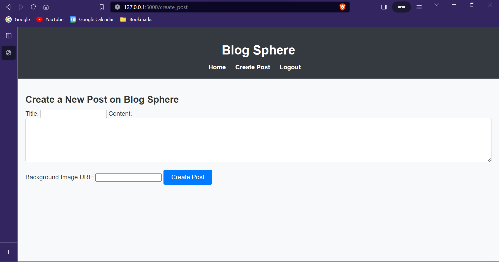

# Blog Sphere - Flask Blogging Platform

Blog Sphere is a simple blogging platform built with Flask, HTML, CSS, and JavaScript. It allows users to register, log in, create, edit, and delete blog posts. The application uses SQLite for persistent storage and includes a user profile page.

## Table of Contents

- [Features](#features)
- [Requirements](#requirements)
- [Installation](#installation)
- [Usage](#usage)
- [Screenshots](#screenshots)

## Features

- User registration and authentication.
- Create, edit, and delete blog posts.
- User profile page displaying user information and their posts.
- SQLite database for persistent storage.

## Requirements

- Python 3.x
- Flask
- Flask-SQLAlchemy
- Werkzeug

## Installation

1. Clone the repository:

   ```bash
   git clone https://github.com/INFOTRIXS/11-Blogging-Platform.git blog-sphere
   ```

2. Navigate to the project directory:

   ```bash
   cd blog-sphere
   ```

3. Create a virtual environment (optional but recommended):

   On Windows:

   ```powershell
   py -3.x -m venv .venv
   ```

   On macOS and Linux:

   ```bash
   python3 -m venv .venv
   ```

4. Activate the virtual environment:

   On Windows:

   ```powershell
   .\.venv\Scripts\activate
   ```

   On macOS and Linux:

   ```bash
   source .venv/bin/activate
   ```

5. Install the required dependencies:

   ```bash
   python -m pip install -r requirements.txt
   ```

6. Run the application:

   ```bash
   python app.py
   ```

   The application will be accessible at [http://localhost:5000/](http://localhost:5000/).

## Usage

1. Open your web browser and go to [http://localhost:5000/](http://localhost:5000/).
2. Register for a new account or log in if you already have one.
3. Explore the home page, create new blog posts, and manage your posts through the user profile page.
4. Log out when you are done.

## Screenshots





